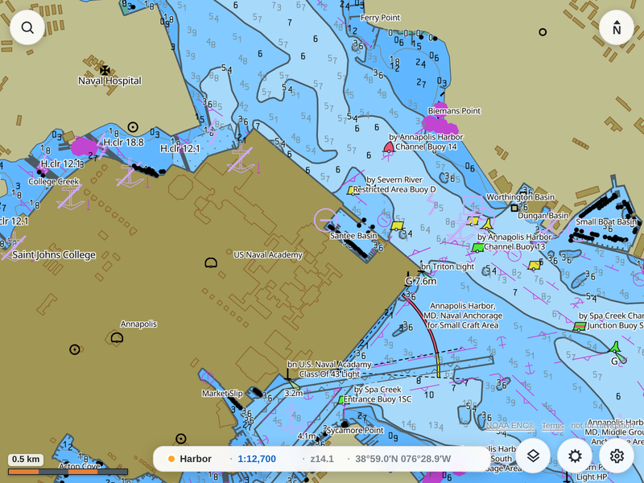
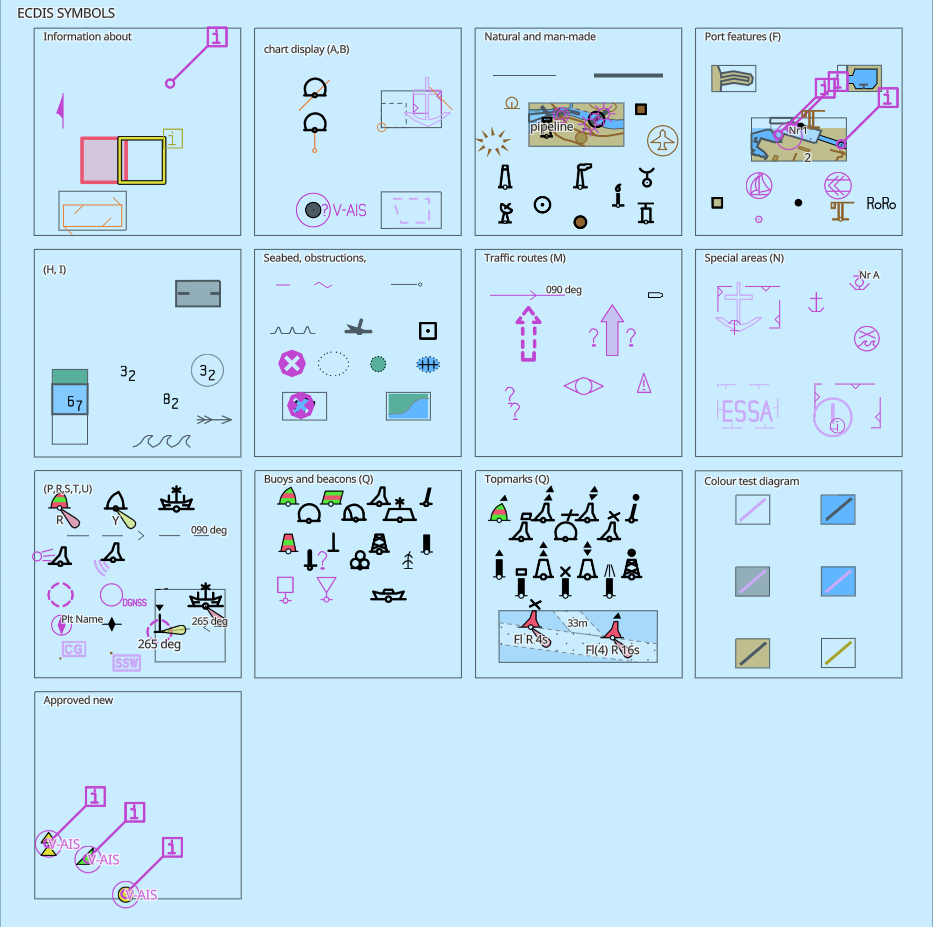

<h1 align="center">chartplotter</h1>

<p align="center">
  <b>⚓ A marine chart plotter.</b><br>
  Turn NOAA S-57 ENC cells into offline vector-tile charts and render them in the browser.
</p>

---

> [!IMPORTANT]
> ### 👉 Looking for the active project? Go to **[Lookout Marine](https://github.com/beetlebugorg/lookout-marine)**.
>
> **[Lookout Marine](https://github.com/beetlebugorg/lookout-marine) is the native
> version of this project, and the current path forward.** It is a fast, native
> chartplotter for **macOS, iPadOS, iOS, Windows, Android and Linux** that draws the
> same official ENC charts with the same IHO S-101 portrayal — but straight to the
> GPU (Metal / Vulkan / Direct3D 12), with a native UI on every platform instead of
> a browser and pre-baked tiles. That is where application development happens now.
>
> **chartplotter is not dead.** It is the web-based take on the same idea, which is
> still its own interesting problem, and I may come back to it.
>
> **[tile57](https://github.com/beetlebugorg/tile57) — the chart engine underneath
> both projects — is very much still supported and actively developed.**

---

<p align="center">
  <a href="https://github.com/beetlebugorg/chartplotter/actions/workflows/ci.yml"></a>
  <a href="https://goreportcard.com/report/github.com/beetlebugorg/chartplotter"></a>
  <a href="LICENSE"></a>
</p>

<p align="center">
  ▶ <b><a href="https://beetlebugorg.github.io/chartplotter/demo/">Try the live demo</a></b>
  &nbsp;·&nbsp;
  📚 <b><a href="https://beetlebugorg.github.io/chartplotter/">Read the docs →</a></b>
</p>

<p align="center">
  <a href="https://beetlebugorg.github.io/chartplotter/demo/" title="Open the live, interactive chart viewer">
    
  </a>
  <br><sub>▶ <b><a href="https://beetlebugorg.github.io/chartplotter/demo/">Open the live, interactive demo</a></b> — official NOAA charts of Annapolis, rendered in your browser. No install, no server.</sub>
</p>

---

> [!WARNING]
> **Not for navigation.** This project is coded almost entirely with AI (Claude).
> It is an experiment in building a large, complex specification (IHO S-101) with
> AI, and a personal learning tool — not a certified or tested product. Do not
> rely on it for real-world navigation. See
> [Known limitations](https://beetlebugorg.github.io/chartplotter/limitations) for
> what the chart rendering does not yet do.

---

chartplotter turns official NOAA nautical charts into fast map tiles you can view
in a web browser, online or fully offline.

It reads **S-57** electronic navigational chart (ENC) cells and draws them with the
**S-101 Portrayal Catalogue**, the modern IHO standard for how charts look. It
writes the result to **PMTiles** archives of vector tiles — **MapLibre Tiles
(MLT)** by default, **Mapbox Vector Tiles (MVT)** on request — plus a matching
MapLibre style. A `<chart-plotter>` web component, built on
[MapLibre GL JS](https://maplibre.org/maplibre-gl-js/docs/), draws the chart.

In short: the heavy lifting happens once, up front. chartplotter reads the raw NOAA
charts and renders every feature — its colors, symbols, and lines — into map tiles
saved on your machine. After that the browser only *displays* those tiles —
panning, zooming, switching palettes — and never touches the raw charts again.

## 🧱 Two repositories, one program

chartplotter is built from two repos that work as a pair:

- **[`chartplotter`](https://github.com/beetlebugorg/chartplotter)** (this repo,
  Go) — the application: the HTTP server and chart library, the `bake`/`serve`
  CLI, NMEA 0183 ingestion, and the `<chart-plotter>` web frontend.
- **[`tile57`](https://github.com/beetlebugorg/tile57)** (Zig) — the chart
  engine. It builds **libtile57**, a native static library that does *all* of the
  chart work: S-57 decoding, S-101 portrayal, web-Mercator tiling, MLT/MVT
  encoding, and generating the MapLibre style and client assets (sprites, color
  tables, line styles, patterns).

**Naming, once:** *libtile57* is the native engine library, built from the
*tile57* repo and statically linked into the Go binary via CGO. The Go code is
the hub around it; the browser only renders what the engine baked.

## 🎯 Goal

Implement the IHO chart standards — **S-57** (ENC data) and **S-101** portrayal
(the successor to S-52), with the wider **S-100 / S-102** family planned — as a
fast, low-memory native engine (tile57, in Zig) wrapped by a small Go server, so
one locally-built binary bakes and serves real charts on anything from a laptop
to a Raspberry Pi on a boat.

## ✨ Features

- **A complete chart pipeline.** libtile57 does every step: ISO 8211 decode, the
  S-57 feature model, S-101 portrayal, tiling, MLT/MVT encode, PMTiles output,
  and the matching MapLibre style + symbol assets.
- **Works offline.** Bake a region once, then serve or ship it. You do not need
  an internet connection to view it.
- **Adjust the chart live.** Switch Day, Dusk, and Night palettes and toggle
  mariner settings — depth shading, soundings, contours, safety-depth danger
  highlighting — and the map restyles at once, without regenerating tiles.
- **Ships as one self-contained binary.** The S-101 catalogue is compiled into
  libtile57 and the web frontend is embedded in the Go binary, so `chartplotter`
  runs from a single file — you supply only the ENC cells. Download a per-platform
  build from the releases page, or build it yourself (see below).
- **Runs a server.** The built-in HTTP server downloads NOAA cells, bakes tiles
  in the background, and serves the frontend with byte-range support.
- **Live position and AIS (early).** Point a **NMEA 0183** feed at the server
  (over TCP) and it shows your **own ship** and **basic AIS targets** on the
  chart. A built-in `simulate` command generates traffic for testing.
- **Draws the whole symbol set.** It renders the complete S-52 Presentation
  Library **ECDIS "Chart 1"** reference sheet — every symbol, line style, area
  fill, and colour — drawn by the same engine that bakes real NOAA charts and
  diffed against the spec's own plots.
  [See the rendered sheet →](https://beetlebugorg.github.io/chartplotter/chart1)

<p align="center">
  <a href="https://beetlebugorg.github.io/chartplotter/chart1" title="How chartplotter renders the S-52 ECDIS Chart 1 symbol sheet">
    
  </a>
  <br><sub>The S-52 PresLib <b>ECDIS Chart 1</b> symbol sheet, rendered by chartplotter — <code>make preslib-chart1</code>.</sub>
</p>

## 🧩 Beyond the chart

The chart is the foundation, not the whole app. The frontend is built from a
`<chart-plotter>` base plus small **plugins** (own-ship and AIS already work this
way), and the goal is a stable **plugin API** so you can build other things on top
of the chart — **instrument gauges**, custom overlays, routes, and more — without
forking the core. NMEA 0183 own-ship and AIS are the first slice of that; expect
the surface to grow and change.

## 📦 Install & build

**Download a binary.** Every tagged release publishes a self-contained
`chartplotter` for **linux and windows** (amd64 + arm64) on the
[releases page](https://github.com/beetlebugorg/chartplotter/releases): unpack
the archive for your platform and run it — the S-101 catalogue and web frontend
are baked in, so you supply only the ENC cells. **macOS** is not shipped as a
prebuilt binary (the engine links Apple frameworks Zig can't cross-compile) — Mac
users build from source below.

Those published binaries embed the **IHO S-101 Portrayal and Feature Catalogues**
(compiled into libtile57 from the IHO's own GitHub repositories, which declare no
license); the project distributes them as an accepted position — see
[THIRD-PARTY-NOTICES.md](THIRD-PARTY-NOTICES.md).

**Build it yourself.** `go install …@latest` does not work — the build links a
native library and uses a local `replace` directive — so you clone two repos and
build locally.

### Requirements

- **Go 1.26+**
- **Zig 0.16** (builds libtile57, and serves as the C cross-toolchain)
- **git** (the engine's submodules fetch the IHO catalogues)

### Recipe

The engine is the [`tile57`](https://github.com/beetlebugorg/tile57) git submodule
at `./tile57` — this repo's `go.mod` points at `./tile57/bindings/go`, and the
Makefile builds `./tile57/zig-out/lib/libtile57.a` on demand. Clone with
`--recurse-submodules` (or just run `make build`, which fetches the submodule and
its nested IHO catalogues on first run).

```sh
git clone --recurse-submodules https://github.com/beetlebugorg/chartplotter.git
cd chartplotter
make build          # fetches the tile57 submodule if needed, zig-builds libtile57,
                    # then a CGO go build → bin/chartplotter
bin/chartplotter version
```

`make build` is the ground truth for how the binary is produced (CGO enabled,
statically linking libtile57); [CLAUDE.md](CLAUDE.md) and the
[Makefile](Makefile) describe the build contract.

## 🚀 Get started

The frontend is built into the binary, so one file is all you need. Start the
server and open the viewer:

```sh
bin/chartplotter serve
# open http://127.0.0.1:8080 → pick a region → it downloads and builds tiles → the chart appears
```

The server writes everything it generates to your cache directory
(`~/.cache/chartplotter`), never into the binary's assets.

You can also bake charts yourself with the `bake` command:

```sh
# Bake cells, a directory, or a NOAA ENC zip into a self-contained chart bundle
# (charts/tiles/chart.pmtiles + per-scheme styles + assets + manifest).
chartplotter bake -o charts US4MD81M.000

# Or write one gap-clipped PMTiles archive per navigational band
# (best-available display), as the static demo/widget workflows use.
chartplotter bake --bands -o charts.pmtiles US5MD_ENCs.zip
```

Tiles are encoded as **MLT (MapLibre Tiles)** by default, which needs MapLibre
GL JS **5.12 or newer** to decode (the bundled viewer vendors 5.24.0, so nothing
to do there). If you want tiles for a consumer without an MLT decoder, bake with
`--format mvt`.

To develop the frontend, serve the assets from disk instead of the embedded
bundle:

```sh
chartplotter serve --assets web
```

## ⛶ Commands

| Command | What it does |
| --- | --- |
| `version` | Print the chartplotter and libtile57 versions. |
| `emit-assets DIR` | Write the S-101 client assets (color tables, sprites, line styles, patterns) to a directory. |
| `catalog-json IN.xml OUT.json` | Distil NOAA `ENCProdCat.xml` into a compact `catalog.json`. |
| `bake -o OUT IN…` | Bake S-57 cells, directories, or NOAA ENC zips into a chart bundle (or per-band PMTiles with `--bands`). |
| `serve [--host] [--port] [--assets DIR]` | Serve the web frontend, the baking API, and the NOAA cell proxy (baked tiles only). |
| `simulate` | Run an NMEA 0183 traffic generator over TCP (own-ship + AIS targets) for testing. |

Run `chartplotter <command> --help` for the full flags.

## 🧭 How it works

```
S-57 ENC cells (.000 + .001… updates)
   │
   ▼
libtile57 — the native engine (Zig, ./tile57 submodule, linked via CGO)
   │  ISO 8211 decode → S-57 model → S-101 portrayal →
   │  web-Mercator tiling → MLT/MVT encode →
   │  MapLibre style + sprites/colors/line styles
   ▼
Chart bundles: PMTiles + style-{day,dusk,night}.json + assets
   │
   ▼
Go server (this repo) — the hub
   │  chart library & background bakes, /tiles + /api,
   │  settings, NMEA 0183 / AIS, aux attachments, plugins
   ▼
<chart-plotter> web component (web/) — MapLibre GL JS
   renders the pre-baked tiles; no portrayal in the browser
```

Read the [**Architecture**](https://beetlebugorg.github.io/chartplotter/architecture)
docs for the full pipeline, and the
[**Tile Schema**](https://beetlebugorg.github.io/chartplotter/tile-schema) for the
layer and field contract the frontend depends on.

## 🛠️ Development

```sh
make build      # zig-build libtile57 + CGO go build → bin/chartplotter
make test       # go test ./...
make vet        # go vet ./...
make fmt        # gofmt -w .
make serve      # build + serve web/ on :8080
make xbuild     # cross-compile with `zig cc` (linux + windows, amd64/arm64)
```

CGO is required — libtile57 is the sole tile/portrayal engine, so
`CGO_ENABLED=0` does not build. Cross-compilation still works with **Zig as the
C toolchain** (`make xbuild` covers linux and windows; darwin must be built
natively on a Mac, because Go's `crypto/x509` links Apple frameworks Zig doesn't
bundle).

### Developing the engine

The engine is the `./tile57` git submodule, and both halves of the build point at
it: `go.mod` replaces the Go binding at `./tile57/bindings/go`, and the Makefile
defaults `TILE57 ?= tile57`. Day-to-day engine hacking works right inside the
submodule — `cd tile57`, check out a branch (a fresh submodule lands detached, so
`git checkout main` first), edit, commit, then `make build` picks the working tree
up as usual. CI builds against the engine's latest `main`; the committed submodule
pin is just last-known-good, bumped with a normal `git add tile57` when you want it.

`go.work` is **optional** here: you only need it to build against a *different*
engine checkout (not the `./tile57` submodule — e.g. a separate sibling clone you
develop in). To do that, redirect both halves — the Go binding via a gitignored
`go.work`, and the Makefile's zig build via `TILE57=<path>`:

```sh
cat > go.work <<'EOF'
go 1.26.0

use .

replace github.com/beetlebugorg/tile57/bindings/go => /path/to/other/tile57/bindings/go
EOF
make TILE57=/path/to/other/tile57 build
```

`go.work`/`go.work.sum` are gitignored, so the override never leaks into a commit;
delete `go.work` to fall back to the `./tile57` submodule.

## 📚 Documentation

Full docs live at
**[beetlebugorg.github.io/chartplotter](https://beetlebugorg.github.io/chartplotter/)**:
install, the CLI reference, the chart pipeline, and the vector-tile schema.

## 📄 License

chartplotter's own code is [MIT](LICENSE) © Jeremy Collins, and so is the
[tile57](https://github.com/beetlebugorg/tile57) engine it links.

It bundles third-party software and data under their own licenses — the Go
dependencies are permissive (MIT / BSD-3-Clause), plus MapLibre GL JS (BSD),
Noto Sans (OFL 1.1), OpenBridge icons (CC BY 4.0), and a GSHHG coastline basemap
(LGPL). NOAA ENC charts are U.S. public domain and **not for navigation**.

The **IHO S-101 Portrayal & Feature Catalogues** are © IHO and are *not* in
either repository; the build fetches them from the IHO's own repositories via git
submodules and compiles them into libtile57 — and therefore into both
locally-built and published binaries. The IHO declares no license; the project
distributes the resulting binaries as an accepted position. See
[**THIRD-PARTY-NOTICES.md**](THIRD-PARTY-NOTICES.md) for the full inventory.
